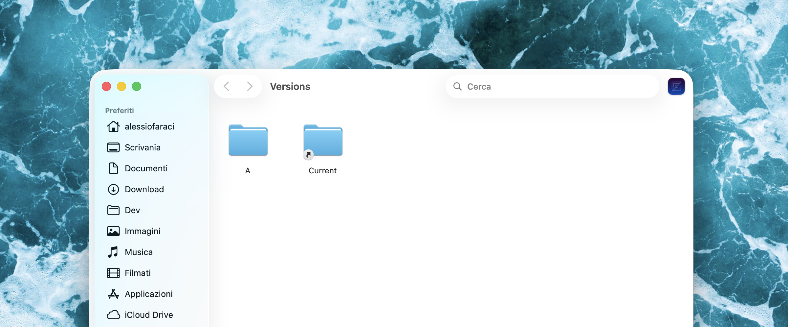

<h1>

  
   Zedify
</h1>
  

    A lightweight macOS utility that opens your current Finder folder directly in the <a href="https://github.com/zed-industries/zed">Zed</a>.
     
    <a href="#about">About</a>
    ·
    <a href="https://github.com/alefaraci/Zedify/releases/download/v2.0/Zedify.dmg">Download</a>
    ·
    <a href="#installation">Installation</a>
    ·
    <a href="#usage">Usage</a>
  

  
  
  
  
  

## About
`Zedify` is a native [`Swift`](https://www.swift.org)/[`AppKit`](https://developer.apple.com/documentation/appkit) app that runs as a background agent (`LSUIElement`) — no dock icon, no menu bar, no UI. When launched, it queries the frontmost Finder window for its directory and opens that path in `Zed`. The first time you run `Zedify`, macOS will ask you to grant it **automation permission** to control Finder.

> [!IMPORTANT]
> `Zedify` requires the [`Zed` code editor](https://zed.dev) to be installed on your Mac.

--- 

## Installation

1. [Download `Zedify.dmg`](https://github.com/alefaraci/Zedify/releases/download/v2.0/Zedify.dmg);
2. Move `Zedify.app` to `/Applications` folder;
3. Go to the `/Applications` folder. While holding the `cmd` key, drag `Zedify.app` to the Finder toolbar.

## Usage

1. Navigate to a folder you want to open with `Zed`;
2. Click on the `Zedify` toolbar icon.

The folder will open in `Zed` editor as a project.

Here's a quick demo:

> [!IMPORTANT]
> If you see a message that the app cannot be opened because it is from an unidentified developer, follow these steps:
>
> 1. Open `System Preferences` > `Security & Privacy Settings`;
> 2. Look towards the bottom of the window for a message saying: *"Zedify was blocked from use because it is not from an identified developer."*;
> 3. Click `Open Anyway` (you may need to enter your admin password);
> 4. Click on the `Zedify` icon again in Finder;
> 5. A confirmation dialog will appear — click `Open` to confirm.

## Credit

App icon inspired by the [`Zed Logomark`](https://zed.dev/brand). "Zed" and the Zed logo are trademarks of Zed Industries, Inc. `Zedify` is not affiliated with or endorsed by Zed Industries, Inc.

## Author

Alessio Faraci, [afaraci.com](https://afaraci.com).

## License

Licensed under the [MIT license](https://github.com/alefaraci/Zedify/blob/main/LICENSE).
